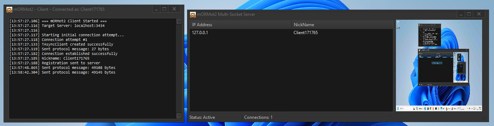

# mORMot2 Multi-Socket Connections

A Pascal/Delphi implementation demonstrating [mORMot2](https://github.com/synopse/mORMot2) async socket programming with connection management, logging, automatic reconnection capabilities, and real-time screenshot sharing.

<p align="center">
  
</p>

## 🚀 Key Features

- **Handle-Based Connection Management** - Uses `TPollAsyncConnectionHandle` for unique client identification
- **Logging** - Comprehensive logging with timestamps and connection lifecycle tracking  
- **Automatic Reconnection** - Intelligent client reconnection with exponential backoff
- **Thread-Safe Operations** - Critical sections protecting all shared data structures
- **Real-time Connection Tracking** - Live ListView updates with IP addresses and nicknames
- **Message Broadcasting** - Send to all clients or individual selected clients
- **🆕 Screenshot Sharing** - Compressed JPEG screenshots with zlib compression
- **🆕 Simplified API** - Clean `SendData(TBytes)` method for all communications
- **🆕 Enhanced Commands** - `All|message` and `Selected|message` command format
- **Memory Leak Prevention** - Proper resource cleanup and object lifecycle management
- **Cross-Platform Ready** - Windows, Linux, macOS compatibility via mORMot2
- **Simple Protocol with Magic Markers** - Binary protocol using TBytes for all data
- **String-Based Commands** - Intuitive command parsing with pipe-delimited format
- **Robust Stream Parser** - Magic marker detection and fragmented TCP data handling

## 📊 Connection Lifecycle

### Server Side Flow
```
1. Client Socket Connect
   ↓
2. TConnection.AfterCreate()
   - Generate unique Handle ID
   - Add to fClients dictionary
   - Update connection counter
   - Wait for nickname registration
   ↓
3. Client sends "NewCon|NickName" via protocol
   ↓ 
4. TConnection.ProcessCommand()
   - Parse nickname using StringOf(TBytes)
   - Update UserData with nickname
   - Add to ListView with IP + nickname
   - Complete registration process
   ↓
5. Normal operation (message exchange, screenshots)
   ↓
6. TConnection.OnClose()
   - Remove from all collections by Handle
   - Update ListView and counters
   - Log disconnection event
```

### Client Side Flow
```
1. TAsyncClient.Create()
   ↓
2. TConnection.AfterCreate()
   - Generate unique nickname (Client + timestamp)
   - Send "NewCon|NickName" via SendData()
   - Update UI to connected state
   - Stop reconnection timer
   ↓
3. Normal operation (receive server messages, capture screenshots)
   ↓
4. TConnection.OnClose()
   - Update UI to disconnected state
   - Trigger OnConnectionLost()
   - Start reconnection timer
   ↓
5. Automatic reconnection attempts every 3 seconds
```

## 📡 Simple Protocol Implementation

### Protocol Structure
```
Magic Marker + Data Size + Data
[$CAFEBABE ] [UInt32    ] [TBytes]
4 bytes      4 bytes      Variable
```

### Key Features
- **Magic Marker**: `$CAFEBABE` for protocol identification
- **Binary Safe**: Uses `TBytes` for all data transmission
- **String Commands**: Pipe-delimited format like 'NewCon|ClientName'
- **Simplified API**: `SendData(BytesOf('Command|Data'))` method

### Usage Example
```pascal
// NEW: Simplified sending with SendData method
SendData(BytesOf('NewCon|' + ClientName));
SendData(BytesOf('All|Hello everyone!'));
SendData(BytesOf('Selected|Private message'));

// Screenshot with binary data
SendData(BytesOf('ScreenShot|') + CompressedImageData);

// Receiving data  
procedure ProcessCommand(const Data: TBytes);
var
  sl: TStringList;
begin
  sl := TStringList.Create;
  try
    sl.Delimiter := '|';
    sl.StrictDelimiter := True;
    sl.DelimitedText := StringOf(Data);
    
    if sl[0] = 'NewCon' then
      RegisterClient(sl[1])
    else if sl[0] = 'All' then
      ShowMessage('Broadcast: ' + sl[1])
    else if sl[0] = 'ScreenShot' then
      ProcessScreenshot(Copy(Data, 11, Length(Data)));
  finally
    sl.Free;
  end;
end;
```

## 🖼️ Screenshot Functionality

### Client-Side Screenshot Capture
```pascal
function CaptureScreenshot: TBytes;
begin
  // 1. Capture screen as bitmap
  // 2. Convert to JPEG (30% quality)
  // 3. Apply zlib compression
  // 4. Return compressed TBytes
end;

// Automatic screenshot on server request
if sl[0] = 'GetScreenShot' then
begin
  ScreenshotData := CaptureScreenshot;
  SendData(BytesOf('ScreenShot|') + ScreenshotData);
end;
```

### Server-Side Screenshot Processing
```pascal
if sl[0] = 'ScreenShot' then
begin
  TThread.Queue(nil,
    procedure
    var
      imageData: TBytes;
      jpgImage: TJPEGImage;
    begin
      // Extract compressed image data (skip "ScreenShot|" prefix)
      imageData := Copy(Data, 11, Length(Data));
      
      // Decompress zlib data
      // Load JPEG from decompressed data
      // Display in TImage component
      Form1.Image1.Picture.Assign(jpgImage);
      Form1.Image1.Stretch := True;
    end);
end;
```

## 📋 Usage Instructions

### 1. Start the Server
1. Open `Server/Server.dproj` in Delphi
2. Compile and run (F9)
3. Server starts on port 3434
4. Status bar shows "Status: Active"

### 2. Connect Clients
1. Open `Client/Client.dproj` in Delphi  
2. Compile and run multiple instances
3. Each client auto-connects and registers
4. Watch ListView populate with client info

### 3. Test Messaging
- **Right-click** in server ListView → "Send to All" 
- **Select client** → Right-click → "Send to Selected"
- Messages appear in client log windows with clear labels:
  - "Message to all: Hello everyone!"
  - "Message to me: Private message"

### 4. Test Screenshot Sharing
- **Select client** → Right-click → "Get Screenshot"
- Client captures and sends compressed screenshot
- Screenshot appears in server's Image component
- Real-time visual monitoring capability

### 5. Test Reconnection
- Close client applications
- Server automatically removes from ListView
- Restart clients - automatic reconnection
- Registration happens seamlessly


## 🎓 Learning Outcomes

This implementation demonstrates:

1. **mORMot2 Async Framework** - Proper use of TAsyncServer/TAsyncClient
2. **Connection Lifecycle** - AfterCreate/OnClose pattern implementation  
3. **Thread Safety** - Critical sections and proper synchronization
4. **Resource Management** - RAII and automatic cleanup
5. **Network Programming** - Client-Server communication
6. **Binary Data Handling** - Screenshot compression and transmission
7. **Error Handling** - Comprehensive exception management
8. **UI Integration** - Real-time updates and visual feedback
9. **API Design** - Clean, simplified method interfaces
10. **Image Processing** - JPEG compression and zlib optimization

Perfect foundation for building scalable network applications with mORMot2.


<p align="center">Made with ❤️ using Delphi RAD Studio</p>